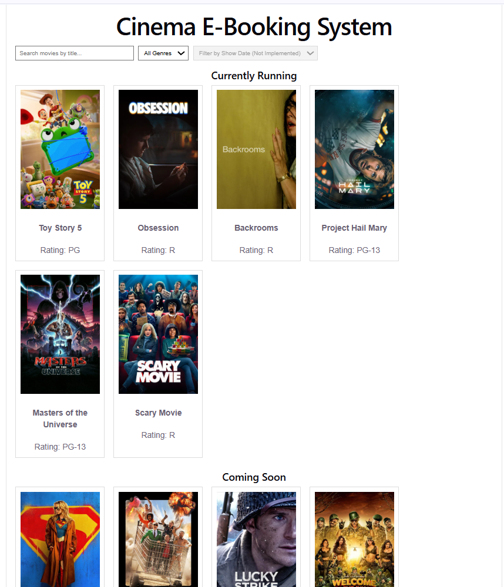
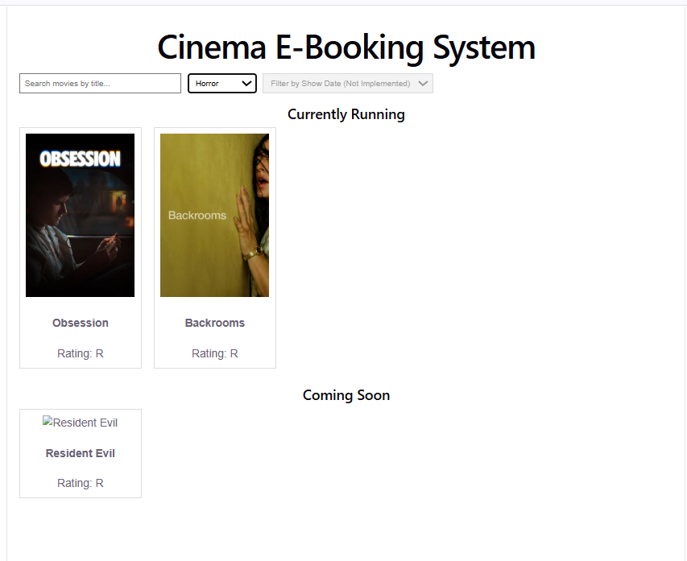
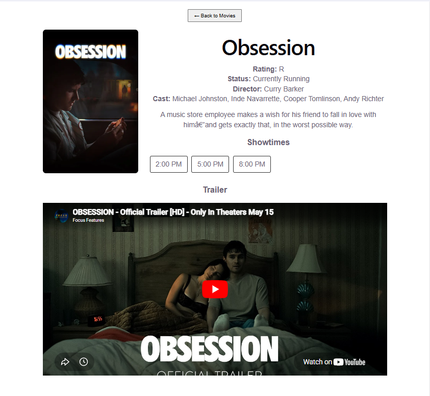

# Cinema E-Booking System (CES)

This branch adds the **Node.js backend**, **Movie Details page**, and **trailer playback** on top of the team's React frontend and PostgreSQL database. This guide lets anyone clone the branch and run the full project locally from scratch.

---

## What this branch includes

- **Node + Express backend** (`ces-backend/`) that connects the frontend to the PostgreSQL database
- **Home Page** populated dynamically from the database
- **Search** by movie title
- **Filter** by genre
- **Movie Details page** with poster, rating, description, showtimes, and an embedded, playable trailer

---

## Prerequisites

Install these first (skip any you already have):

- [Node.js (LTS)](https://nodejs.org/) — includes `npm`
- [PostgreSQL 17](https://www.postgresql.org/download/) — includes `psql`
- [Git](https://git-scm.com/)

Verify they work by running each of these (each should print a version number):

```bash
node --version
npm --version
psql --version
git --version
```

> **Windows note:** If `psql` says "not recognized," PostgreSQL's tools aren't on your PATH. Add them by running this in PowerShell (adjust `17` to your version), then close and reopen PowerShell:
> ```powershell
> [Environment]::SetEnvironmentVariable("Path", $env:Path + ";C:\Program Files\PostgreSQL\17\bin", "User")
> ```

---

## Step 1 — Download database(sql) files

This branch does **not** include the database SQL files. Get them from the `tate/database` branch on GitHub:

1. On GitHub, switch to the **`tate/database`** branch and open the **`database`** folder.
2. Download **`schema.sql`** and **`seed.sql`** (open each file, click the download arrow).
3. Save both somewhere easy to find, e.g. a folder called `Project2`.

You will need the full path to these two files in Step 4.

---

## Step 2 — Clone this branch

In a terminal, go to the folder where you want the project, then:

```bash
git clone -b afrin/backend https://github.com/C33011/SWE-Term-Project.git
cd SWE-Term-Project
```

This downloads the frontend and backend directly onto the `afrin/backend` branch.

---

## Step 3 — Create the database (first time only)

Open the PostgreSQL shell (enter your `postgres` password when prompted):

```bash
psql -U postgres
```

Then paste these lines one at a time:

```sql
CREATE USER swe_user WITH PASSWORD 'password';
CREATE DATABASE swe_db OWNER swe_user;
GRANT ALL PRIVILEGES ON DATABASE swe_db TO swe_user;
\c swe_db
GRANT ALL ON SCHEMA public TO swe_user;
\q
```

> **Already ran this before and want a clean slate?** Use this instead (it deletes the old database first, so you won't get "relation already exists" errors):
> ```sql
> DROP DATABASE IF EXISTS swe_db;
> CREATE DATABASE swe_db OWNER swe_user;
> \c swe_db
> GRANT ALL ON SCHEMA public TO swe_user;
> \q
> ```
> (If you see "role swe_user does not exist," run the `CREATE USER swe_user...` line first.)

---

## Step 4 — Load the schema and seed data

Use the **full path** to the two files you downloaded in Step 1. Replace the paths below with where you actually saved them. Type `password` when prompted each time:

```bash
psql -U swe_user -d swe_db -f "C:\path\to\schema.sql"
psql -U swe_user -d swe_db -f "C:\path\to\seed.sql"
```

Example with a real path:

```bash
psql -U swe_user -d swe_db -f "C:\Users\you\Documents\Project2\schema.sql"
psql -U swe_user -d swe_db -f "C:\Users\you\Documents\Project2\seed.sql"
```

**Verify it worked** — this should print `12`:

```bash
psql -U swe_user -d swe_db -c "SELECT COUNT(*) FROM movies;"
```

> **Known issue:** `seed.sql` may show two errors that say `more than one row returned by a subquery` (around lines 107 and 183). This is a bug in the seed file, not your setup. It causes a couple of movies to be skipped, but the app still runs. Ask the database owner for an updated `seed.sql` if you need all movies.

---

## Step 5 — Create the backend `.env` file

The `.env` file holds the database password, so it is **not** on GitHub. Create it yourself.

From inside the `SWE-Term-Project` folder, run this in PowerShell to create it automatically:

```powershell
@"
DB_HOST=localhost
DB_PORT=5432
DB_NAME=swe_db
DB_USER=swe_user
DB_PASSWORD=password
PORT=8080
"@ | Out-File -Encoding utf8 ces-backend\.env
```

Or create `ces-backend/.env` by hand with this content:

```
DB_HOST=localhost
DB_PORT=5432
DB_NAME=swe_db
DB_USER=swe_user
DB_PASSWORD=password
PORT=8080
```

---

## Step 6 — Run the backend

```bash
cd ces-backend
npm install
npm run dev
```

You should see:

```
CES backend running on http://localhost:8080
```

**Leave this terminal open** — it is serving the backend.

---

## Step 7 — Run the frontend

Open a **second** terminal (keep the backend one running):

```bash
cd ces-frontend
npm install
npm run dev
```

Then open the link it shows (usually `http://localhost:5173`) in your browser.

You now have the full app running: backend on port 8080, frontend on port 5173.

---

## Troubleshooting

| Problem | Cause | Fix |
|---------|-------|-----|
| `psql` not recognized | PostgreSQL not on PATH | See the Windows note under Prerequisites |
| `relation "genres" already exists` | Tables already created | Harmless, or use the clean-slate reset in Step 3 |
| `more than one row returned by a subquery` | Bug in `seed.sql` | Known issue, see note in Step 4 |
| Homepage is empty (no movies) | Database not seeded, or backend can't connect | Re-check Step 4 prints `12`; confirm `.env` matches your DB |
| `relation "movies" does not exist` (in backend window) | Database has no tables | Re-run Step 4 to load `schema.sql` and `seed.sql` |

---

## Quick reference

| What | Command | Where |
|------|---------|-------|
| Start backend | `npm run dev` | `ces-backend/` |
| Start frontend | `npm run dev` | `ces-frontend/` |
| Stop a server | `Ctrl + C` | in its terminal |

---

## Screenshots

### Home Page (movies from database)


### Filter by genre


### Movie Details page with trailer

